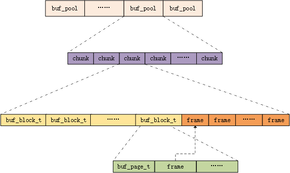
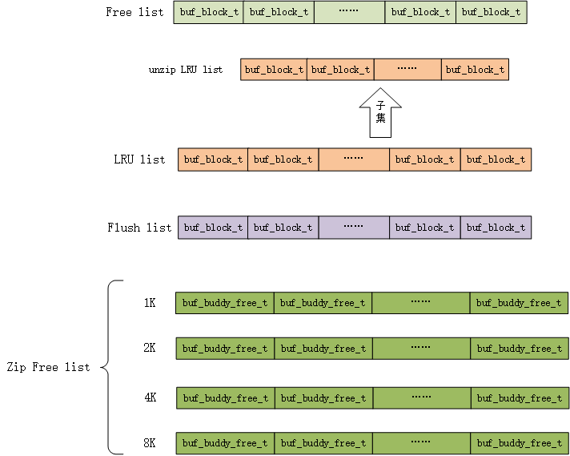

# Percona-Server Buffer Pool 

> [函数清单](./Buffer_Pool函数清单.md)

## Buffer Pool 模块
InnoDB存储引擎的Buffer Pool负责缓存从磁盘读入的数据，它的核心模块为：

+ LRU 管理：处理事务读写数据的请求
+ Flush 管理：将脏页刷到磁盘

这两个模块完成了Buffer Pool的主要功能，但在MySQL中，开发者在这两个核心模块的基础添加了一些额外的模块用于提高MySQL的性能和可靠性。

+ buddy allocator ： 用于分配大小不等的压缩页空间
+ checksum：校验和，用于校验压缩页的正确性
+ double write buffer (dblwr)：用于维护页的完整性

校验和自然不用多说，这是在计算机网络和文件系统中十分常用的检测数据错误的机制。

buddy allocator常翻译为伙伴系统，这也是一个操作系统中常见的概念。由于MySQL Buffer  Pool是以页为单位组织的，页的大小固定，即我们常说的固定大小内存分配，这种内存分配方式并不适用于变长的压缩页。压缩页有1K、2k、4k、8k等不同的大小。为了更好的利用空间，MySQL设计了伙伴系统用于变长内存分配。伙伴系统的概念十分简单，内存中维护多个不同大小的块的链表。当请求一个size大小的块时，从块最小的链表找起，找到恰好大于size的链表，从链表中分配一个块给请求者。若是该链表为空，则分配更大一级的块，切分后返回给请求者。例如请求一个2K大小的块，在2k链表中搜索，若是此链表为空，则从4k链表中分配一块4K大小的块，2K空间返回给请求者，剩余2K空间放入2K链表。

double write buffer的设计目的是为了提高页的可靠性，可能会发生的一个场景是当MySQL正在刷页时，页刷到一半，发生了宕机，这种情称为部分写失效。double write buffer 由两个区（128页左右，具体大小与页的大小有关）组成，刷脏页时，首先会将脏页刷到dblwr中，然后将dblwr顺序写入到共享表空间的磁盘中，顺序写入完成后，再将dblwr中的页离散的写入到各个表空间中。这样就有效的避免了部分写失效的场景，恢复时可以在dblwr中找到页的副本。

## Buffer Pool 内存结构

上文也提到过，Buffer Pool的内存分配是等长分配的。

MySQL中有多个Buffer Pool实例，每个Buffer Pool实例分为多个chunk，chunk是Buffer Pool内存分配和resize的基本单位。chunk是一块连续的内存，前半部分是一个buf_block_t数组，buf_block_t是非压缩页的控制块，后半部分则是非压缩页的内容——frame，控制块中有一个指针用于指向自己对应的页的frame。buf_block_t的首个成员变量是buf_page_t，这是压缩页的控制块，其中也存在一个指针zip.data，指向压缩页的内容，压缩页的内容空间不在chunk中，而是由buddy系统动态分配。由于这种设计，buf_page_t和buf_block_t指针可以互相转换，这一转换操作在源码中十分常见。

## Buffer  Pool 链表

Buffer Pool中存在多种链表，这些链表将页按照不同的用处组织起来。

+ Free list：指空白页，buffer pool刚刚创建时所有页都会添加到free list中，当有使用页的请求时，从free list中拿取。
+ LRU list ：存放由磁盘读入的页的链表，MySQL的LRU链表分配young和old两个部分，由一个old指针区分，页被读入时，放入到old部分的头部，驱逐页时，从old部分的末尾选择可替换的页，只有在old链表中存在一定时间的页才会被加入到young部分，即young是热点数据，old是一般数据和冷数据。这一设计是为了避免长扫描引起的热点数据驱逐现象。
+ unzip LRU list：此链表为LRU 链表的子集，存放的是解压过的LRU页，它与LRU链表保持同步，即对两者中一个的操作会同时影响到两个链表，且页在两个链表中的顺序相同。
+ Flush list：LRU中的脏页会放入到flush 链表中，等待刷盘，刷盘操作由另外的线程负责。
+ Zip Free list：上文提到过的，buddy系统中的多个不同大小的块的链表，用于变长内存分配。buf_buddy_free_t是一个C++联合体，组成部分是一个标志大小的size域和一个bytes数组，其中有一些位用于标志该内存块的状态。有意思的是，buf_buddy_free_t与buf_block_t、buf_page_t也可以直接进行类型转换。

## Buffer  Pool中的线程

Buffer Pool中的线程主要与flush有关，有三种线程：
+ buf_flush_page_coordinator_thread
+ buf_flush_page_cleaner_thread
+ buf_lru_manager_thread

buf_flush_page_coordinator_thread的任务是刷脏页，系统中只会有一个，线程启动时的参数是一个数字n_page_cleaners，线程初始化后会创建n_page_cleaners-1个工作线程。之后，coordinator线程会像一般的工作线程一样处理刷盘请求。而该线程退出时，会唤醒其余的工作线程，使工作线程全部退出。

buf_flush_page_cleaner_thread，page_cleaner工作线程，平时处于睡眠状态，收到刷盘请求时会被唤醒，执行刷盘请求。唤醒时若发现退出标志，则会跳出循环，销毁自身。

buf_lru_manager_thread是每个buffer pool实例都会创建的线程，任务是将LRU链表中的脏页刷盘，并将清空的页放入free链表。