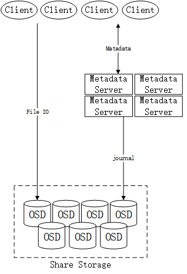

> 时间：2019年12月5日 周四
>
> 记录人：wei

## 本周工作内容

#### wei

+ JSON 序列化工具库
+ 网络库与序列化库文档
+ Ceph论文略读

#### zhang

+ Libevent网络库测试

#### liu

+ Ceph论文阅读

#### sun

+ YSCB论文阅读

## 讨论内容

### Ceph系统与可以参考的理论

Ceph是一个分布式文件系统，在经过论文《Ceph: A Scalable, High-Performance Distributed File System 》的简要讨论之后，我们发现了ceph的设计与我们的项目目标有许多相似的部分，其中有一些值得借鉴的理论。

上图是ceph的架构简图。

主要的借鉴点有：

1. 都是面向云场景的软件系统，侧重点都是扩展性，ceph更是一个比较成熟的，广泛应用于生产环境的云产品；

2. 底层存储上，ceph也是采取了共享存储集群作为持久化存储；

3. ceph使用生成函数实现去集中化的数据分布，任意节点都都可以通过inode number构建的对象名计算存储的位置，可以为我们设计去集中化的分布式锁表做参考；

4. ceph的元数据由专门的matadata server负责分布式缓存，并使用日志技术在共享存储中持久化。为了平衡负载，ceph使用了树结构定位元数据的位置，如下图：

   

   这种元数据管理方法称为"动态子树分割"，ceph认为典型的文件系统中**元数据操作可能会占一半的负载**，Ceph 的 MDS 集群基于动态子树分割策略 ，能在节点之间自适应地按层级（hierarchically ）分发缓存的元数据 （cached metadata）。primary-copy 缓存策略使得对任意一份 metadata，只有一个权威的 MDS 负责管理 缓存一致性和更新顺序化。可以看出，这一元数据索引结构与B树相似，叶节点是具体的元数据，这一方案是否可以成为B树索引多点更新问题的参考解决方案？

尽管分布式文件系统与共享存储的数据库是两个不同的系统，但我们认为在元数据管理和去集中化分布式管理方面ceph可以为我们提供很好的参考，并且ceph成熟的负载均衡、故障恢复等方案可能也能成为参考。

### Libevent网络库封装与RapidJSON序列化库的封装

我们简要封装了libevent网络库与RapidJSON库，将网络传输与数据序列化工具化，为未来的开发做准备，具体的代码文档可以阅读——[multi_net_io库文档](../../doc/multi_net_io.md)

但在编写这一工具的过程中，我们也发现了很多问题。libevent基本只提供了socket连接和相关的buffer处理，可调整性很高，但带来的问题是需要自己编写的处理非常多，这一版本的库只是针对远程文件IO设计，是否能很好的完成mysql页的传输是存在疑问的。

可能产生的问题包括但不仅限于：

1. 连接的断开在我们的简单封装中是没有检测的，可能发生未知的错误或丢包；
2. 使用这一套工具，服务端需要处理包的分类和辨识，并将包交由指定的函数处理，增加了调用端的逻辑；
3. 同一个端口处理不同类型的包是比较困难的，需要统一两种作用没有关联的包的格式；
4. 缺少流量控制机制，多连接发包或是单连接发包速度过快时，是否会产生溢出并丢包，这一问题是未知的。

目前这一套工具应该可以基本满足远程IO实验需要，会产生什么样的问题只有在实验过程中观察。若未来需要更为复杂、稳定的网络传输时，可能会更换底层网络传输为更为成熟的BRPC或GRPC。

### YCSB负载

这一部分的调研不够充分，只是简单讨论一下后续调研应该向YSCB的数据特征、冲突控制方法等方向继续调研。

## 遗留问题

+ Ceph动态子树规划的具体流程
+ MySQL数据页的具体内容
+ 网络库的功能不完善可能会带来的不良影响
+ YCSB负载的负载特征

## 下周工作计划

#### wei

+ MySQL数据页内容分析

+ MySQL页的网络传输测试

#### zhang

+ 远程IO测试

#### liu

+ Ceph 论文细读
+ 动态子树规划方案

#### sun

+ YCSB论文细读，整理YCSB文档

