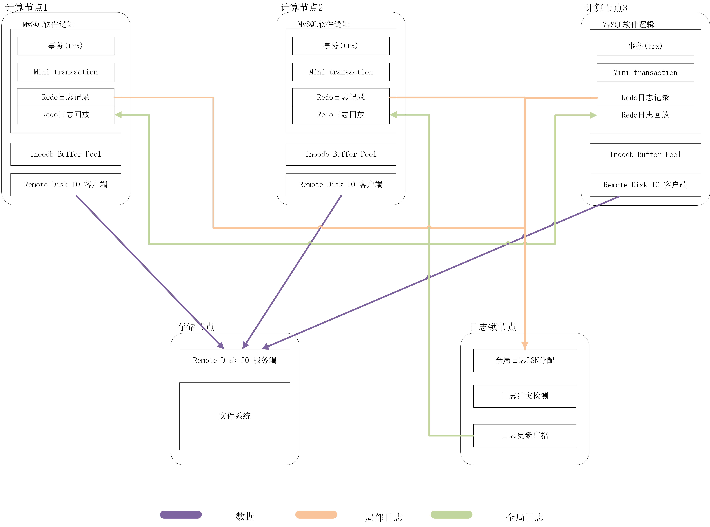
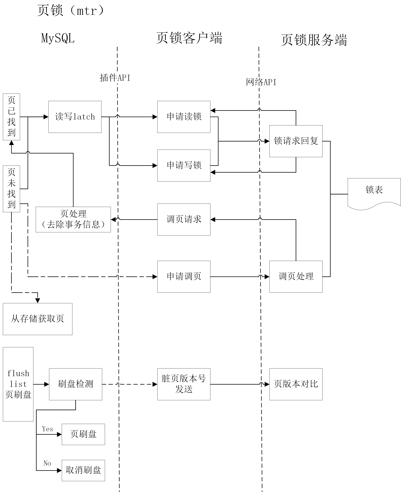
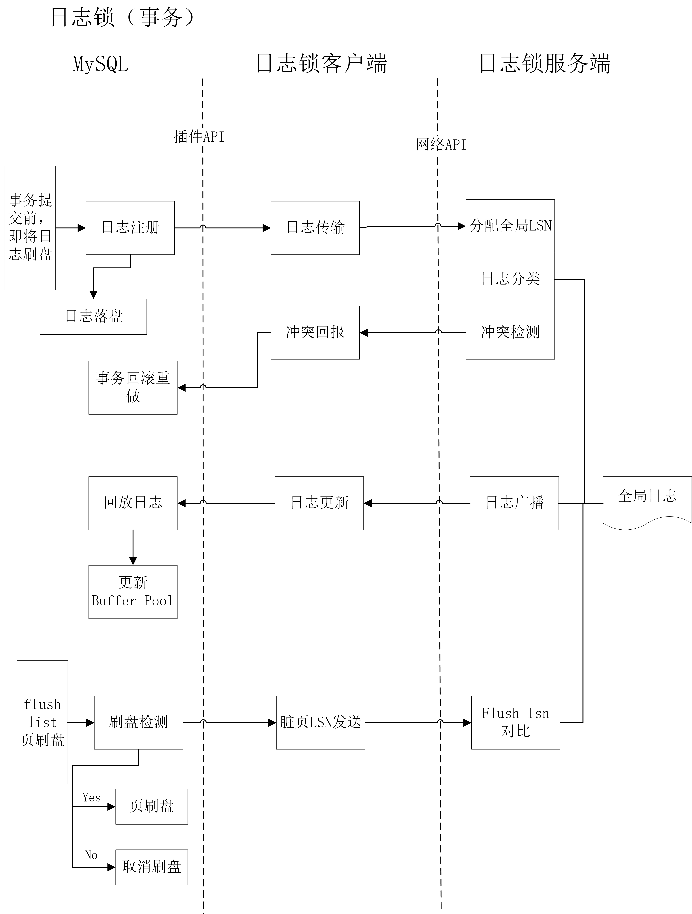

# 2019年末总结

## 架构总结

这半年来，我们基于sqlite模拟了远程IO的实现方案、阅读分析了MySQL源码和架构、调研市场上现有的多主更新实现方案，制定了一种基于全局日志的多主更新Buffer实现方案。该方案的架构图如上图，计算层使用MySQL解析SQL语句、管理事务信息、生成redo日志。

计算层所需的数据通过inoodb buffer pool中特定的页获取，页的持久化由远程IO模块负责，嵌入MySQL的远程IO客户端将buffer pool的刷页请求转换成文件IO请求，将文件IO请求发送给存储节点，存储节点执行指定的文件IO操作后返回结果。借此，实现共享存储的模拟。

多主更新中产生的buffer一致性问题，我们计划通过redo日志的全局一致性协议实现。MySQL执行完事务后会在提交前产生redo日志，我们通过协调多个节点的redo日志、检测日志中的冲突读写、广播全局日志的更新、回放日志更新buffer pool等几种技术手段，保证多节点的buffer一致性。

## 页锁->日志锁

最初我们的工作方向集中于通过页锁实现多节点buffer pool的一致性，但在实践之后我们认识到了页锁的局限性，最后转向使用跨节点的append锁来保证全局有序日志，从而通过回放无冲突的全局日志更新数据页的方式解决buffer pool一致性问题。

### 页锁的设计方案

#### 流程

1. 在buffer pool中搜索指定页，上读写latch，同时，向远程锁管理器申请读写锁，等待锁管理器的回复后进行后续操作；（写锁需要更新页的全局版本）
2. 若是页在buffer pool中未找到，则有两种选择：
	1. 从存储中读取页
	2. 从其余节点的buffer pool中获取页（该情况下需要去除页中的事务信息、锁信息等）
3. MySQL中脏页的刷新是异步的，根据buffer pool的一些指标决定何时刷页。若并非每次写操作都会更新所有节点上的页，则此处刷盘前需要对比页的版本号，避免旧版本的脏页覆盖文件中的新版本数据页。

#### 问题

实现集中式页锁表的过程中，发现了一些问题：
1. 远程申请读写锁的网络开销相当大，页锁需要频繁的申请读写锁。以mtr为单位实现时，同一事务可能会多次申请同一个页的锁；
2. 页的“净化”比较困难，MySQL的页除了数据之外，包含了许多头部信息，其中包含了事务信息、锁信息等依赖于特定节点的描述，页传输前需要手动清除；
3. 与第一条中的说明类似，页锁的设计会导致频繁的页传输，例如有一个节点修改页A后，有两种页传输：（1）向下一个获得锁的节点发送页；（2）已持有旧版本的页A的节点需要更新本地buffer pool中的页A。第一种页传输比较好处理，第二种需要广播修改后的页A到所有的持有页A副本的节点上。而页传输的过程中，页锁是不能释放的。两种页传输都确认完成的话，等待时间会相当的长。若是取消第二种页传输，允许读取较旧的页，则会造成集群中不同节点的页版本混乱，缺乏好的处理机制的话，还会由于页的换出破坏文件中的数据（节点是不知道自己读的页版本比文件中的版本旧的，换出会直接覆盖新的页）；
4. mysql标准页的大小是16K，传输的数据包大小也是比较大的。
5. <u>**页锁和页的种类都很多**</u>，意向锁等复杂的锁类型，分类处理需要的工作量较大，而且可能会带来更多次的锁申请和检测；不同的页也会需要不同的处理，这一点在mysql中也十分复杂，例如临时表空间的页、压缩页都需要特殊的处理，更不用谈b树中非页节点与叶节点的分开处理。

### 日志锁的设计方案

#### 流程
将页锁转换为redo日志末尾上的append锁，实现全局的日志有序。记录全局日志序号与本地日志序号的对应关系。
1. 要求读写的页在本地buffer pool中不存在时，从存储节点读取页；
2. 产生redo log时，向集中式锁管理器申请锁并传输日志内容，锁管理器记录本地日志的序号和内容，记录后释放锁；
3. 
3. 锁管理器在全局日志更新后，向所有节点广播，所有节点更新本地缓存；
4. 锁管理器缓存每个页对应的最大全局日志序号和文件中每个页对应的最大全局日志号，任意节点刷盘前需要向锁管理器确认，页为最新可刷新，页并非最新或是已有节点刷过，则取消刷盘。

#### 优点
1. 网络传输的频率会相对减少，仅在事务提交前进行几次网络传输；
2. 无需执行页的“净化”，由日志回放获得的页一定是本地buffer pool直接可用的，且日志回放的逻辑也是MySQL中已实现好的；
3. 日志占用的空间小于页；
4. 无需处理多种类页带来的复杂性。

## 当前的问题

1. 远程IO替换MySQL原本的异步IO时存在一些BUG，仍然在排查处理中；
2. 对于类型众多的MySQL文件，暂时很难较为精确的区分应该置于共享存储的文件和应该置于本地文件系统的文件；
3. libevent网络库原生实现很难适应MySQL较高频率的网络请求，当发送频率和发送数据量较大时，内核来不及处理较快较多的网络传输，从而导致丢包、连接断开等问题，这一BUG还在修复中。

## 下一阶段的计划和分工

|  工作内容    |  责任人     |
| ---- | ----- |
|   远程IO模块嵌入MySQL的bug修复   | zhang |
|   远程IO模块插件化代码结构调整   | zhang |
| 远程IO模块说明文档编写 | zhang |
| 网络库的进一步完善（添加包的自动分割发送机制）| wei   |
| 全局日志收集与分类存储的实现与实验 | wei |
| 项目相关论文与资料的阅读 | liu、sun |

